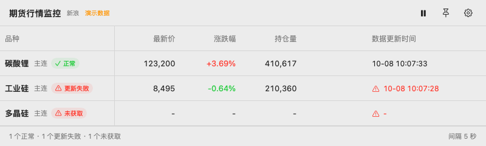
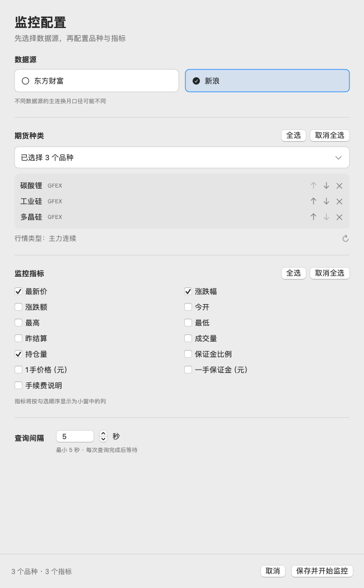

# 期货行情监控 1.0

原生 macOS 期货主力连续行情监控工具，使用 SwiftUI / AppKit。配置东方财富或新浪数据源、自选品种、显示指标及查询间隔，以可调整大小的小窗显示行情。

## 功能

- 数据源优先配置，品种可搜索、全选、取消全选、调整顺序；指标也支持全选和取消全选。
- 每个品种独立查询；失败保留该行上次成功数据并将行情时间标红，首次失败显示 `-`。
- 查询间隔最低5秒，以每次查询完成后等待计算；全局请求启动至少间隔0.5秒，监控品种较多时实际刷新周期会增加。
- 小窗支持置顶、暂停、横向/纵向滚动；横向滚动固定品种首列，纵向滚动固定表头，缩小时行间距逐渐降低至最小值。
- 拖动品种表头右侧分隔线调整列宽，自动记住宽度；右键分隔线可恢复默认，长名称支持中间省略和完整名称提示。
- 点击品种名称，在默认浏览器打开所选数据源的主连K线页面；东方财富默认日K，新浪进入后可切换日K。
- 可选保证金比例、一手合约价值、一手保证金、手续费说明。公司资料来自东方财富期货官网公示，参考金额不等于账户实际占用。

详细操作见 [使用说明](APP_README.md)，模块与验证情况见 [架构文档](doc/architecture.md)。

## 界面预览

以下是实际SwiftUI视图的离屏渲染，使用人工演示数据，不是实时行情；渲染脚本见 `scripts/render-previews.sh`。





## 环境与构建

应用最低 macOS 14。本机验证环境为 macOS 14.6.1、Apple Silicon、Swift 6.0.3。构建需要 Apple Xcode 或 Command Line Tools（包含 macOS SDK、Swift 编译器和 iconutil），以及 Python 3，仅用于构建辅助脚本，不是应用运行依赖。

```bash
bash scripts/test.sh
bash scripts/build.sh
"dist/期货行情监控.app/Contents/MacOS/FuturesMonitor" --self-test
open "dist/期货行情监控.app"
```

默认构建当前机器架构。可用 `FUTURES_ARCH=arm64` 或 `FUTURES_ARCH=x86_64` 指定架构；自检应在对应架构的机器上执行。Intel 运行尚未在本机验证。`FUTURES_OUTPUT_DIR` 可指定输出目录。应用不依赖 Python 虚拟环境或其他外部运行时。

脚本使用 ad-hoc 本地签名，没有 Developer ID 签名或公证。正式下载版本应在发布说明中明确签名状态；如需发行给普通用户，应另行完成 Developer ID 签名及公证。这里只提供源码和本地构建流程。

## 验证

`bash scripts/test.sh` 运行独立的 Swift Testing 单元与集成测试，可用 `--filter MonitorStoreTests` 筛选测试。测试支持 Swift 6.0.3 及更高版本，使用代码内人工构造的最小响应和可控模拟服务，不访问行情网站。测试按功能组织于 `Tests/`，失败后其他测试仍会执行；5秒节流与轮询检查标记为 `.slow`。

`--self-test` 用于应用包冒烟检查，验证目录资源、模拟查询、配置恢复和暂停；不修改用户真实配置。本次完整本地回归的56项测试、8项应用包自检及手动联网样本检查通过，详细范围与重试情况见 [版本验证](APP_VERIFICATION.md)。GitHub Actions 配置运行两层离线检查；尚未验证远端执行，不代表已通过远端CI或启用分支保护。

```bash
# 手动联网检查，会实际访问东方财富与新浪；不要放进每次PR的自动测试
"dist/期货行情监控.app/Contents/MacOS/FuturesMonitor" --live-check
# 生成只包含公开文件的源码zip，不需要初始化Git
python3 scripts/package-source.py
# 将默认dist目录内的应用打包，保留UTF-8文件名和可执行权限
python3 scripts/package-app.py
```

联网验证可能因交易时段、网络、接口变化或提供方限制失败。CI只执行离线测试与应用包自检。[验证地图](doc/tests.md)区分已有测试与未覆盖项。

## 数据口径与限制

- 仅展示主力连续行情，主连不是可下单的月份合约。不同来源换月口径可能不同。
- 东方财富涨跌幅按昨收计算，涨跌额按昨结算；新浪涨跌幅和涨跌额按昨结算。
- 更新时间来自行情数据本身；成功获取不代表行情无延时。东方财富中金所网页行情延时约15分钟；盘中休市可能使行情时间保持不变。参见 [官方说明](https://qhweb.eastmoney.com/quote)。
- 公司保证金、手续费可能按具体合约调整，手续费公示为收费上限；账户实际标准以期货公司与结算单为准。
- 使用提供方公开网页接口，没有接口稳定性或调用额度保证。开源代码许可证不授予行情或第三方资料的商业展示、转授权或再分发许可；相关使用条件需向数据提供方确认。来源清单见 [第三方说明](THIRD_PARTY_NOTICES.md)。

## 项目结构

| 路径 | 内容 |
| --- | --- |
| `Sources/FuturesMonitor/` | 应用、行情解析、轮询和自检 |
| `Resources/` | 应用元信息与最小品种标识目录 |
| `Tests/` | 按功能组织的 Swift Testing 单元与集成测试及人工输入 |
| `Tests/Fixtures/` | 仅目录编码检查文本，无HTML/JSON样本 |
| `scripts/` | 测试、构建、图标生成、工具链兼容和源码打包 |
| `doc/` | 架构、流程、权限、配置、轮询、验证说明 |

## 贡献与许可

请阅读 [贡献指南](CONTRIBUTING.md) 与 [安全说明](SECURITY.md)。自有源码、图标生成脚本和人工测试样本使用 [MIT](LICENSE)；第三方服务和最小标识目录的来源及许可边界另见 [第三方说明](THIRD_PARTY_NOTICES.md)。版本变化见 [CHANGELOG](CHANGELOG.md)。
