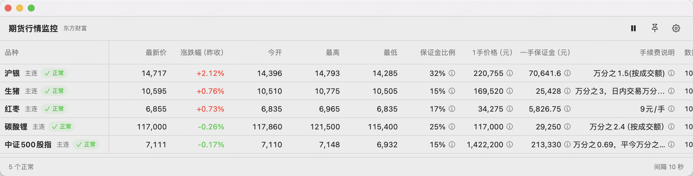
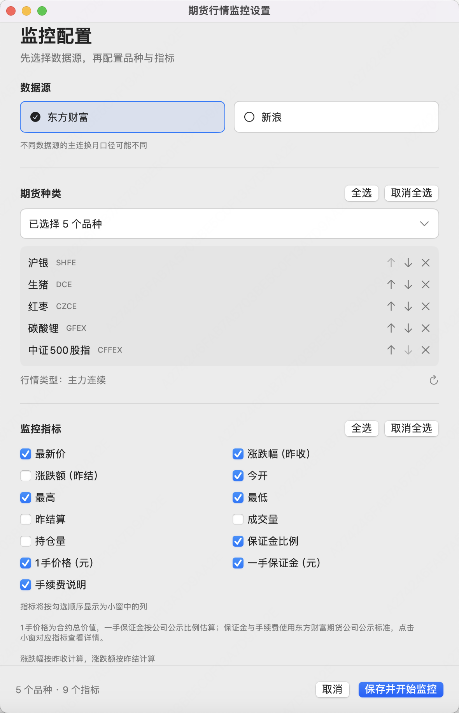

# 期货行情监控 1.0

原生 macOS 期货主力连续行情监控工具，使用 SwiftUI / AppKit。配置东方财富或新浪数据源、自选品种、显示指标及查询间隔，以可调整大小的小窗显示行情。

开源仓库：[zhawlll/futures-market-monitor](https://github.com/zhawlll/futures-market-monitor)，当前版本标签为 `1.0`。

## 功能

- 数据源优先配置，品种可搜索、全选、取消全选、调整顺序；指标也支持全选和取消全选。
- 每个品种独立查询；失败保留该行上次成功数据并将行情时间标红，首次失败显示 `-`。
- 查询间隔最低5秒，以每次查询完成后等待计算；全局请求启动至少间隔0.5秒，监控品种较多时实际刷新周期会增加。
- 小窗支持置顶、暂停、横向/纵向滚动；横向滚动固定品种首列，纵向滚动固定表头，缩小时行间距逐渐降低至最小值。
- 拖动品种表头右侧分隔线调整列宽，自动记住宽度；右键分隔线可恢复默认，长名称支持中间省略和完整名称提示。
- 点击品种名称，在默认浏览器打开所选数据源的主连K线页面；东方财富默认日K，新浪进入后可切换日K。
- 可选保证金比例、一手合约价值、一手保证金、手续费说明。公司资料来自东方财富期货官网公示，参考金额不等于账户实际占用。

详细操作见 [使用说明](APP_README.md)，模块设计见 [架构文档](doc/architecture.md)。

## 界面预览

以下为当前版本的实际应用窗口截图，展示东方财富数据源、5 个自选品种与 9 个指标。截图中的行情、保证金和手续费仅反映截取时的状态，不会随文档更新；数据口径与限制见下文。





## 环境与构建

应用需要 macOS 14 或以上。源码构建需要 Swift 6.0 或以上、Xcode 或 Command Line Tools（包含 macOS SDK），以及用于构建辅助脚本的 Python 3；应用运行无需 Python。

在项目根目录执行构建并启动应用：

```bash
bash scripts/build.sh
open "dist/期货行情监控.app"
```

默认构建当前机器架构，应用输出到 `dist/期货行情监控.app`。启动后选择数据源、品种、指标和查询间隔，点击“保存并开始监控”；行情窗口支持暂停、置顶和打开设置。详细操作见 [使用说明](APP_README.md)。

## 数据口径与限制

- 仅展示主力连续行情，主连不是可下单的月份合约。不同来源换月口径可能不同。
- 东方财富涨跌幅按昨收计算，涨跌额按昨结算；新浪涨跌幅和涨跌额按昨结算。
- 更新时间来自行情数据本身；成功获取不代表行情无延时。东方财富中金所网页行情延时约15分钟；盘中休市可能使行情时间保持不变。参见 [官方说明](https://qhweb.eastmoney.com/quote)。
- 公司保证金、手续费可能按具体合约调整，手续费公示为收费上限；账户实际标准以期货公司与结算单为准。
- 使用提供方公开网页接口，没有接口稳定性或调用额度保证。开源代码许可证不授予行情或第三方资料的商业展示、转授权或再分发许可；相关使用条件需向数据提供方确认。来源清单见 [第三方说明](THIRD_PARTY_NOTICES.md)。

## 项目结构

| 路径 | 内容 |
| --- | --- |
| `Sources/FuturesMonitor/` | 应用、行情解析、轮询和自检 |
| `Resources/` | 应用元信息与最小品种标识目录 |
| `Tests/` | 按功能组织的 Swift Testing 单元与集成测试及人工输入 |
| `Tests/Fixtures/` | 仅目录编码检查文本，无HTML/JSON样本 |
| `scripts/` | 测试、构建、图标生成、工具链兼容、源码与应用打包 |
| `doc/` | 架构、流程、权限、配置、轮询、验证说明及界面截图 |
| `.github/` | 离线构建、CodeQL、Dependabot 及 Issue/PR 模板 |

## 贡献与许可

请阅读 [贡献指南](CONTRIBUTING.md) 与 [安全说明](SECURITY.md)。自有源码、图标生成脚本和人工测试样本使用 [MIT](LICENSE)；第三方服务和最小标识目录的来源及许可边界另见 [第三方说明](THIRD_PARTY_NOTICES.md)。版本变化见 [CHANGELOG](CHANGELOG.md)。
